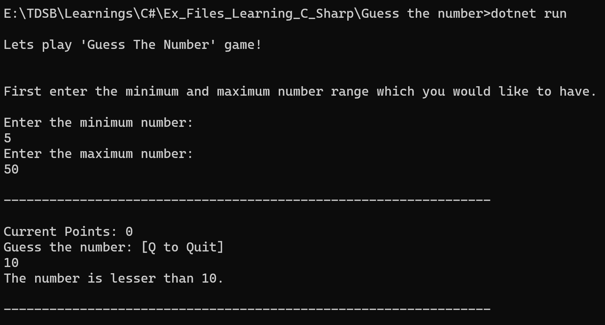
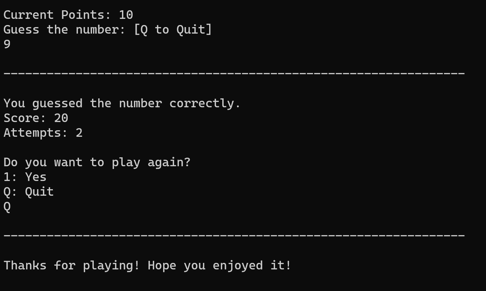

# Guess_the_number

## This is a console based game which allows the players to choose the range of numbers. The program then will pick any random number from within that range and let the user guess that number.

## The program also gives user hints(i.e. Greater than or Less than) to find the number, gives a score(based of the distance of the player's guess) as well as shows the total attempts taken by the user. The intention of making this game was to learn C#.

